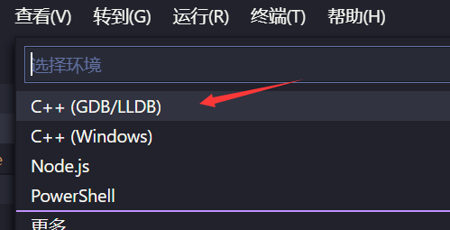
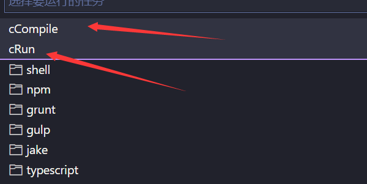
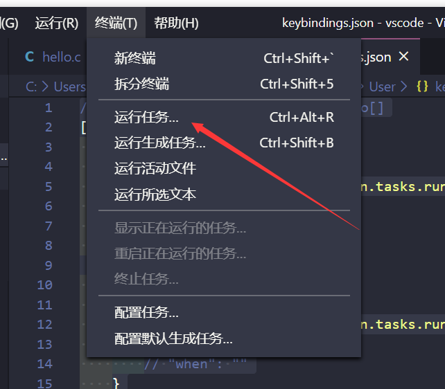
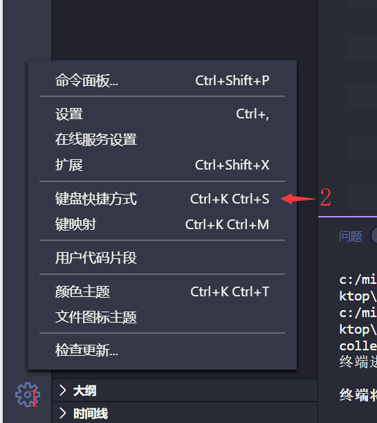
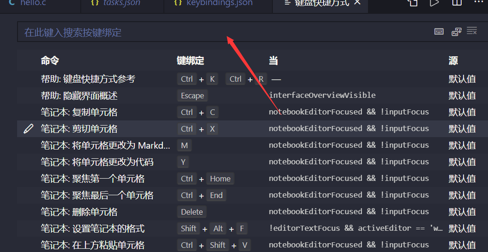

## win 10 vs code 搭建C语言编译运行环境

### 官方的方法

教程链接[Using GCC with MinGW](https://code.visualstudio.com/docs/cpp/config-mingw)

这里对方法的总结如下:

1. 安装MinGW,并配置环境变量(百度就有)

2. 安装vs code(同样是百度就有)

3. 安装汉化插件(为了方便咱们交流,毕竟我英语不好)

   

   - 如上图,点击圈起来的图标,这其实就是插件商店入口,当然也有快捷键,这可以自行百度
   - 搜索chinese, 安装上图所指的Chinese(Simplified)插件
   - 重启vs code生效

4. 安装C/C++插件

   

   - 和安装汉化插件差不多
   - 看上图步骤1, 2, 3

5. 新建(也可以不新建)一个文件夹, 然后`文件` -> `打开文件夹`, 打开刚才新建的文件夹

6. 新建一个`.c`结尾的文件

   

   - 如上图,先点1处
   - 再点击2处
   - 3处有几个图标, 把鼠标放上去就有提示
   - 按照提示完成文件的创建, 比如我的是`hello.c`
   - 打开`hello.c`

7. `终端` -> `配置默认生成任务` -> 选择下面这个就可以了

   

   ​	这一步之后,文件夹里面多了一个`.vscode`文件夹,里面多了一个`tasks.json`文件, 保持默认就行了,如果非要研究清楚`tasks.json`文件的含义,可以百度,可以看官方文档。

8. 经过上面的步骤,以后就可以通过快捷键`ctrl+shift+b`编译c程序了,具体过程就是:

   - 打开相应的`.c`文件, 然后`ctrl+shift+b`就可以完成编译
   - 编译完成会在源代码同目录下生成一个和源代码文件名字相同但是后缀为`.exe`的可执行文件
   - 这时候可以通过终端使用命令行运行这个可执行文件

9. 如果不想使用命令行执行文件,就进行以下步骤

10. `运行` -> `添加配置`, 选择下面的选项

    

11. 然后选择下面这一选项

    

12. 经过上面几步, `.vscode`文件夹又多了一个`launch.json`文件, 保持不变就行了。还是那句话,要研究其中的含义,就使用搜索引擎或者看官方文档

13. 以后就可以通过`f5`直接运行c程序了

14. 然后可以通过对`C/C++`插件进行一些设置就可以设置使用的编译器类型和c标准的版本,这还是自己搜索设置。不过我设置了之后感觉并不生效

15. 因为通过这样的方式进行编译运行我感觉输出的提示信息太多,对于我这样的小白又看不懂,我目前也就需要看看`error`和`warning`, 所以我觉得这个方法不太适合我,所以我对该方式的研究也就到此,至于更多的有关这个插件的设置可以参考上面给出的文档,也可以网上搜索

### 使用code runner插件

​	这个方式可以说比上面的方式简单得多, 而且其输出信息对于我这样的小白还是很友好的.步骤总结如下:

1. 安装`C/C++`插件, 其实这可以不安装,不过一般都建议安装,因为这个不仅是能够使我们能够通过上面的方法进行c代码的编译运行, 还有其他很多用途,比如更好地支持语法高亮,更智能地自动补全等(好像是吧)

2. 安装`Code Runner`插件

3. 打开要运行地源代码文件

4. `ctrl+alt+n` 或者直接点击下面这个图标运行

   

5. `ctrl+alt+m`停止程序运行

6. 更多操作参考作者的官文[[VSCode插件推荐] Code Runner: 代码一键运行，支持超过40种语言](https://zhuanlan.zhihu.com/p/54861567)

### 本人使用的土著办法

​		这一方法好像还是有一些原创性啊,虽然也基本网上搜得到,但是文章不多,而且比较散或者说不清楚。我原本比较习惯使用`notepad ++`之类的文本编辑器，这种编辑器可以支持语法高亮但是小巧,而且可以通过一些配置可以在其中运行命令行指令。实际上，C语言源代码的编译就是通过`gcc`指令，而程序的运行实际上就是直接运行编译所得的可执行程序。所以我想vs code中是否也能如此，后来发现确实可以，这里总结如下：

1. 当然第一步最好还是要装一下`C/C++`插件，哈哈，毕竟这个是vs code官方推荐，这个插件对`C/C++`程序提供了很多服务（服务不知道表述是不是有问题）

2. 直接在`.vscode`文件夹（如果没有自己新建）新建一个`tasks.json`文件，文件内容如下：

   ```json
   {
       // See https://go.microsoft.com/fwlink/?LinkId=733558
       // for the documentation about the tasks.json format
       "version": "2.0.0",
       "tasks": [
           {
               "label": "cCompile",//命令的别名，后面有用
               "type": "shell",
               "command": "gcc ${file} -o ${fileDirname}\\${fileBasenameNoExtension}.exe -std=\"c99\"",
               //我们使用cmd编译C语言代码时的编译指令
               "problemMatcher": []
               //这一行大概就是为了能够使用快捷键运行而没有那些有的没的确认操作
               //总之照着般就行了
           },//这一个大括号括起来的就是一个指令了
   
           {
               "label": "cRun",
               "type": "shell",
               "command": "${fileDirname}\\${fileBasenameNoExtension}.exe",
               "problemMatcher": []
           },
       ]
   }
   ```

   上面的代码设置了两个指令，一个是`cCompile`用来编译源代码，一个是`cRun`用来运行编译所得的可执行文件

3. 经过上面的配置，我们就可以通过这样的方式执行指令：`终端` -> `运行任务` -> 选择需要执行的指令就可以了，如下图

   

4. 但是这样似乎太麻烦了，我就想着给这两个指令设置两个快捷键吧，设置快捷键的方式：

   - `ctrl+shift+p` -> ` 输入：keyboard` -> `选择如下图所示的选项`

     

   - 在打开的文件`keybindings.json`中输入以下内容并保存：

     ```json
     // 将键绑定放在此文件中以覆盖默认值auto[]
     [
         {
             "key": "ctrl+alt+c",//指定快捷键
             "command": "workbench.action.tasks.runTask",
             //这一行实际上就是定位到了终端中的运行任务这一选项卡
             "args": "cCompile",
             //这个是刚才的"script"中指定的名称，也就是指令的脚本名称
             // "when": ""
         },
         //上面大括号中的内容就为cCompile指令设置了快捷键，下面同理
     
         {
             "key": "ctrl+alt+r",
             "command": "workbench.action.tasks.runTask",
             "args": "cRun",
             // "when": ""
         }
     ]
     ```

     上面的`"command": "workbench.action.tasks.runTask"`实际上就是定位到了如图所示的位置

     

     `"args": "cRun"`就是定位到了我们自定义的脚本，然后为其设置快捷键，`cRun`就是上面定义的`label`标签的值

5. 至此快捷键的设置就结束了，此后就可以通过`ctrl+alt+c`进行c代码的编译，通过`ctrl+alt+r`运行程序了。

6. 这里说一下需要注意的地方，就是快捷键如何保证不重复

   - `设置` -> `键盘快捷方式` 

     

   - 在下面的输入框中输入欲设置的快捷键，如果没有搜索结果就说明该快捷方式未被使用

     

7. 方法教程结束